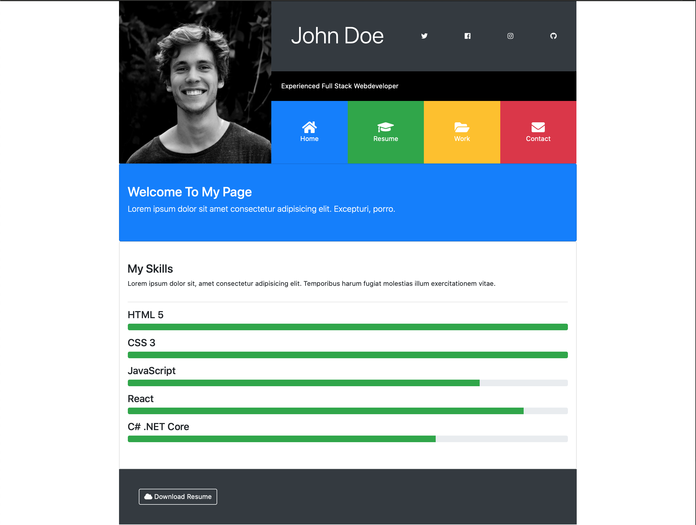
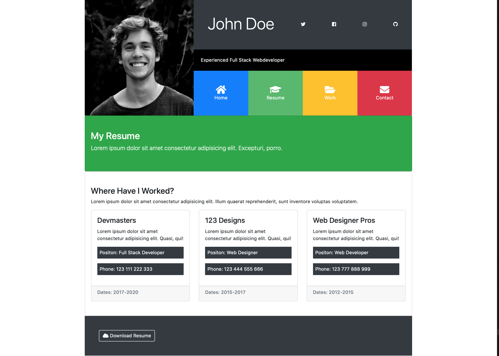
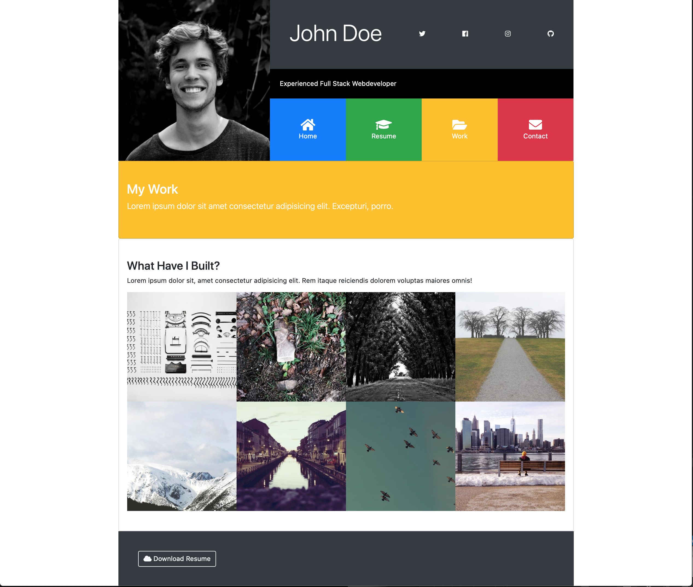
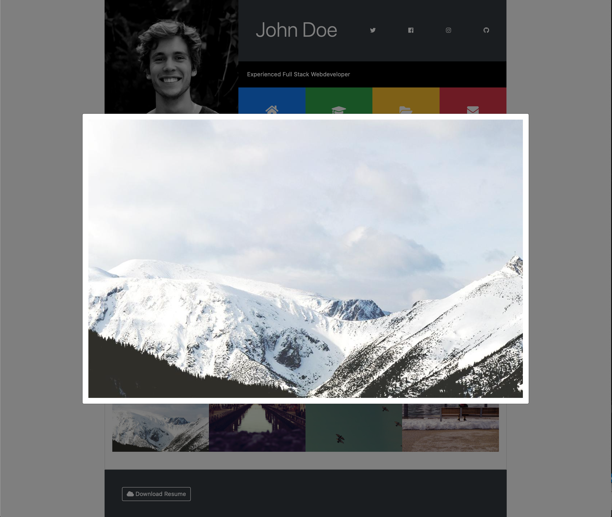
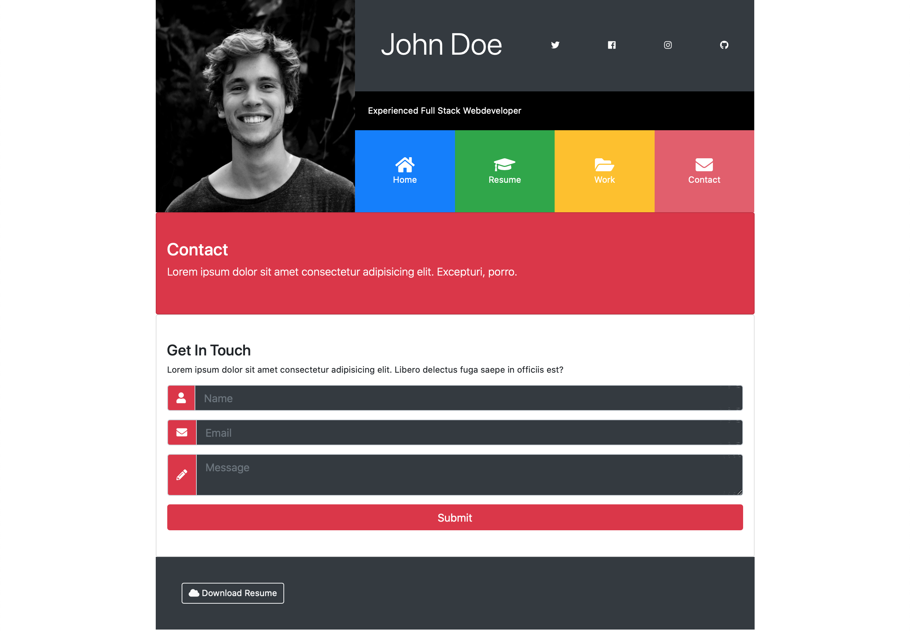

# Portfoliogrid - A Portfolio website built with bootstrap

A Portfolio website built with bootstrap

Using ekko-lightbox for jQuery for the image gallery
(https://ashleydw.github.io/lightbox/)

# Screenshots

Home

Resume

Work

Work lightbox

Contact

## Author

- Albert Stjärne (https://github.com/AlbertStjarne)
